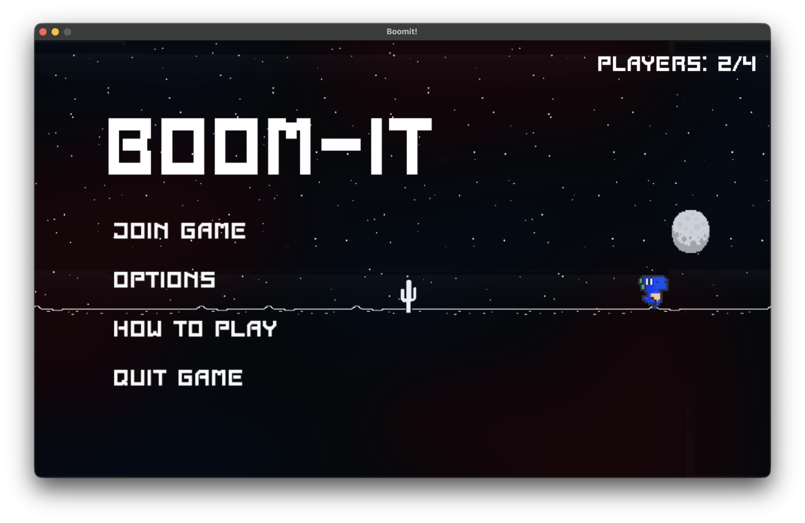
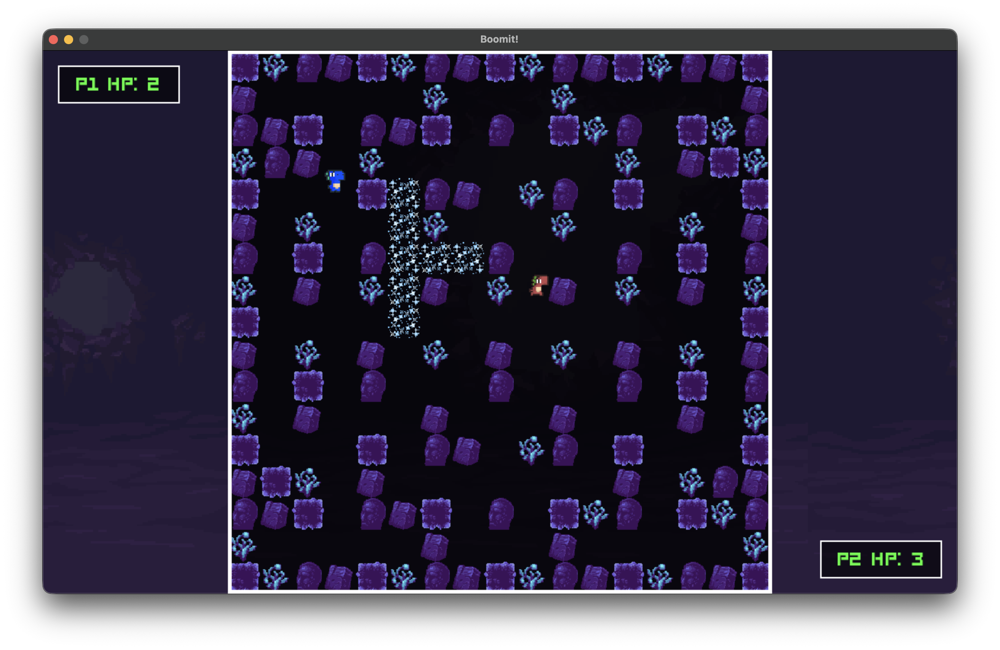
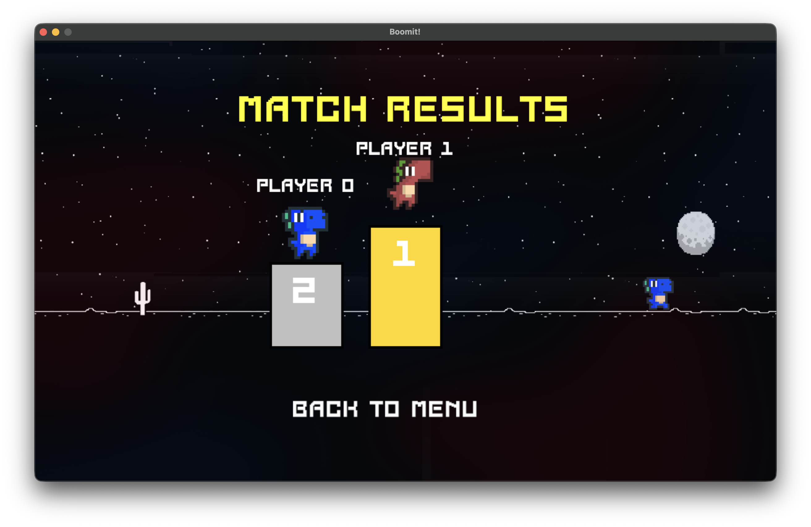

# BoomIt - Multiplayer Bomberman Game

## Game Description

**BoomIt** is a multiplayer Bomberman-style game built with Python and Pygame. The game supports up to 4 players competing simultaneously on various themed maps. Players navigate grid-based arenas, strategically place bombs to eliminate opponents, and avoid explosions in a thrilling battle royale experience.

### Key Features:
- **4-Player Multiplayer Gameplay** - Compete against up to 3 other players in real-time
- **Multiple Maps** - Three uniquely themed game boards with parallax scrolling backgrounds
- **Dynamic Animations** - Smooth character movements, bomb explosions, and blast effects
- **Grid-Based Movement** - Strategic tile-based navigation system
- **Sound Effects & Music** - Audio with explosion effects and background music
- **UI Menus** - Main menu, options and lobby 

---

## Project File Structure

```
Multiplayer-Game-C-DP/
├── main.py                    # Main game entry point and scene manager
├── network_server.py            # UDP server for multiplayer networking
├── settings.py                  # Game configuration (constants, paths, settings)
│
├── core/
│   ├── board.py                 # Game board/grid management and rendering
│   ├── game_scene.py            # Main game loop and gameplay logic
│   └── network.py               # Network client with threading for multiplayer
│
├── entities/
│   ├── game_object.py           # Base class for all game entities
│   ├── player.py                # Player character class with animations
│   ├── bomb.py                  # Bomb and explosion logic
│   └── background_diamond.py    # Additional game objects
│
├── ui/
│   ├── base_menu.py             # Base menu class (button handling, navigation)
│   ├── main_menu.py             # Main menu screen
│   ├── options_menu.py          # Game options/settings menu
│   ├── how_to_play_menu.py      # Instructions and game rules
│   ├── lobby.py                 # Multiplayer lobby (wait for players)
│   ├── end_screen.py            # End game results and ranking screen
│   ├── map_background.py        # Static map background rendering
│   └── parallax_background.py   # Parallax scrolling background effects
│
├── assets/                      # Game resources
│   ├── background/              # Menu and parallax backgrounds
│   ├── maps/                    # Map-specific assets (3 maps)
│   │   ├── map_0/
│   │   ├── map_1/
│   │   └── map_2/
│   ├── bombs/                   # Bomb and explosion animations + icon
│   ├── player_images/           # Character sprites (4 players)
│   │   ├── player_0/            # Idle, movement, death, hatch animations
│   │   ├── player_1/
│   │   ├── player_2/
│   │   └── player_3/
│   ├── fonts/                   # Game fonts
│   └── other/                   # UI elements (buttons, overlays)
│
└── sounds/                      # Audio files
    ├── stateside_zara_larsson_sound.ogg  # Background music
    ├── explosion.wav            # Bomb explosion sound
    └── hurt.wav                 # Player damage sound
```

### Core Components:

- **main.py** - Game controller that manages scene transitions (menu → lobby → game → end screen)
- **settings.py** - Centralized configuration for all game constants, asset paths, and gameplay parameters
- **network.py** - Handles client-side network communication with background threads
- **network_server.py** - UDP server that manages player connections and game state synchronization
- **game_scene.py** - Main game logic, player updates, bomb handling, collision detection
- **board.py** - Renders and manages the grid-based game world
- **player.py** - Player entity with movement, animations, and bomb placement
- **bomb.py** - Bomb logic including countdown and explosion mechanics

---

## Concurrent Programming Methods

The BoomIt project employs several concurrent programming techniques to handle real-time multiplayer synchronization:

### 1. **Threading (Core Networking)**
   - **Location:** `core/network.py`
   - **Implementation:** Uses `threading.Thread` for background network operations
   - **Methods:**
     - `_receive_loop()` - Daemon thread that continuously receives player data from server
     - `_ping_loop()` - Daemon thread that sends periodic ping messages to maintain connection and detect timeouts
   - **Purpose:** Allows network I/O to run asynchronously without blocking game rendering

### 2. **Daemon Threads**
   - All network threads run as daemon threads (`daemon=True`)
   - Automatically terminate when the main game thread exits
   - Prevents hanging processes on game shutdown

### 3. **UDP Socket Communication**
   - **Protocol:** Asynchronous UDP (datagram-based) instead of TCP
   - **Non-blocking Operations:** Socket operations with timeout to avoid thread stalls
   - **Data Serialization:** Uses Python's `pickle` module for object serialization over network

### 4. **Server-Side Concurrency (network_server.py)**
   - **Timeout Management:** Tracks last received message from each player to detect disconnections
   - **State Synchronization:** Broadcasts game state to all connected players each frame
   - **Multi-player Support:** Handles up to 4 concurrent player connections
   - **Non-blocking Server Loop:** Single-threaded event loop with socket timeout

### 5. **Game Loop Synchronization**
   - **Frame-Based Updates:** All game updates synchronized to FPS (60 FPS)
   - **State Broadcasting:** Network sends all players' positions and states each frame
   - **Thread-Safe Data Access:** Shared `all_players_data` list updated by receive thread

---

## External Libraries & Frameworks

| Library | Version | Purpose |
|---------|---------|---------|
| **Pygame** | Latest | 2D graphics rendering, animations, input handling, audio |
| **Python Standard Library** | 3.8+ | |
| &nbsp;&nbsp;- `socket` | Built-in | UDP network communication |
| &nbsp;&nbsp;- `threading` | Built-in | Background network threads |
| &nbsp;&nbsp;- `pickle` | Built-in | Object serialization for network transmission |
| &nbsp;&nbsp;- `time` | Built-in | Game timing, frame control, heartbeat intervals |
| &nbsp;&nbsp;- `sys` | Built-in | System utilities |

### Pygame Modules Used:
- `pygame.display` - Window management
- `pygame.image` - Asset loading and transformation
- `pygame.font` - Text rendering
- `pygame.mixer` - Audio playback
- `pygame.event` - Input handling
- `pygame.transform` - Image scaling and manipulation
- `pygame.draw` - Shape rendering (border outlines)
- `pygame.time.Clock` - Frame rate control
- `pygame.Rect` - Collision detection

---

## Screenshots





---

## Group Member Contributions

| Member | ID | Contributions |
|--------|------|-----------------|
| Martyna Ignaczak  | 197905  | UI Implementation, Game Logic, Network Protocol Discussion, Server Testing |
| Marta Dubowik | 198320 | TCP/UDP Analysis, Server Implementation, Bug Fixing & Debugging |
| Alicja Zabłocka | 197772 | TCP/UDP Analysis, Server Implementation, Bug Fixing & Debugging, README documentation |

### Detailed Contributions:

#### **Martyna Ignaczak (197905)**
- **UI Implementation** - Integrated assets (backgrounds, player sprites, animations, menu interfaces, music, and sound effects)
- **Game Logic** - Implemented core mechanics (player movement, bomb placement, explosions, collision detection, health system)
- **Network Protocol** - Participated in TCP/UDP analysis; advocated for UDP to minimize latency in real-time gameplay
- **Server Testing** - Conducted multiplayer testing sessions to validate functionality

#### **Marta Dubowik (198320)**
- **TCP/UDP Analysis** - Led protocol evaluation; documented UDP advantages (low latency, stateless) over TCP for real-time gaming
- **Server Implementation** - Designed and coded `network_server.py` with player connection management, timeout detection, and state synchronization
- **Testing** - Validated protocol performance with 2-4 concurrent players under various network conditions
- **Bug Fixing** - Debugged network synchronization, player state updates, and data serialization issues

#### **Alicja Zabłocka (197772)**
- **TCP/UDP Analysis** - Researched protocol characteristics and impact on game responsiveness; helped document decisions
- **Server Infrastructure** - Implemented player tracking, heartbeat mechanism, disconnection handling, and state broadcasting
- **Testing** - Tested server stability and protocol efficiency; identified optimization opportunities
- **Bug Fixing** - Resolved synchronization errors, data corruption, collision detection, and network packet issues
- **README Documentation** - Created comprehensive project documentation and setup instructions

---

## Fast Tutorial

### Prerequisites:
- Python 3.8 or higher
- Pygame library

### Installation:
1. Clone the repository
2. Install dependencies: `pip install pygame`
3. Update `SERVER_IP` in `settings.py` with server machine's IP address
4. Start the server: `python network_server.py`
5. Run the game: `python main.py`

### Running the Game:
1. Launch multiple instances of `main.py` (up to 4 clients)
2. Each client connects to the server
3. Join game and wait for other players
4. Once 2-4 players are ready, the game begins


